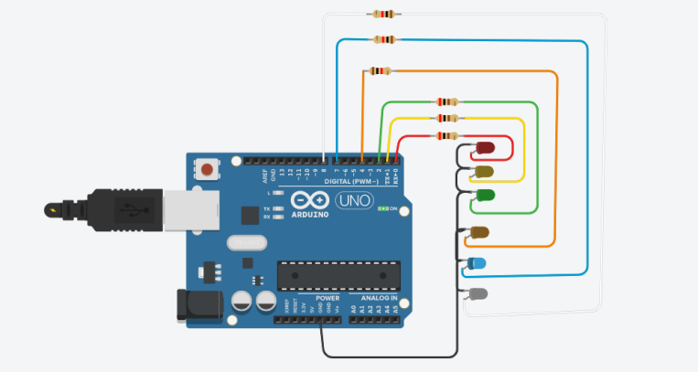
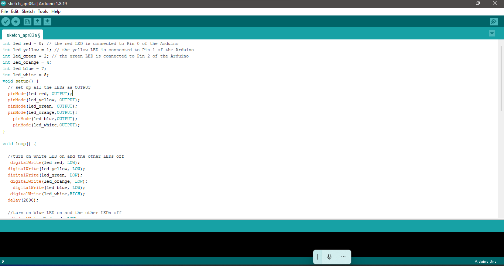

##  What is Arduino? Led-light blinkies using Arduino UNO R3

  This is a simple arduino project that sequentially blinks from white going to red. Each has a time out of 2 seconds.
  

  

##  What is Arduino?

Arduino is an open-source hardware and software company, project, and user community that designs and manufactures single-board microcontrollers and microcontroller kits for building digital devices.

## Materials Needed 
* Arduino UNO R3
* Arduino IDE
* Wires
* Led lights - x6(red, yellow, green, orange, blue, white)
* Resistors - x6

